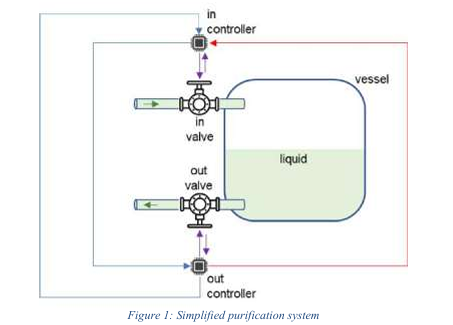
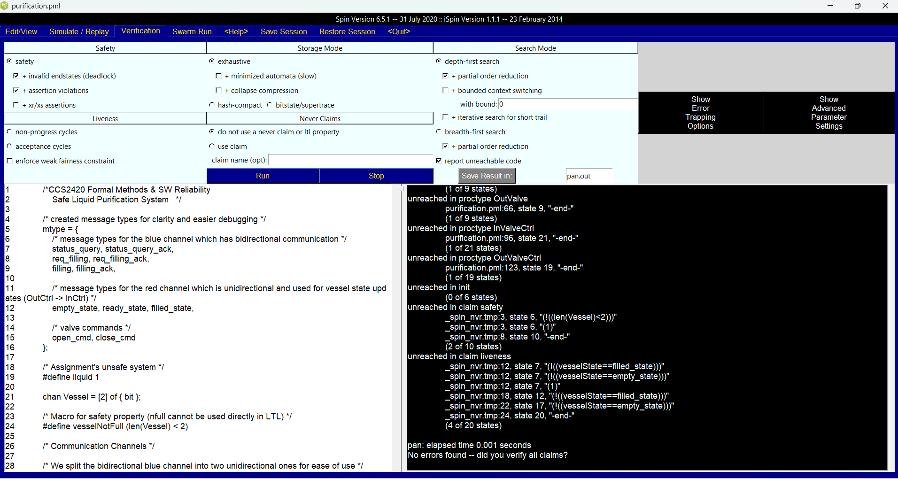
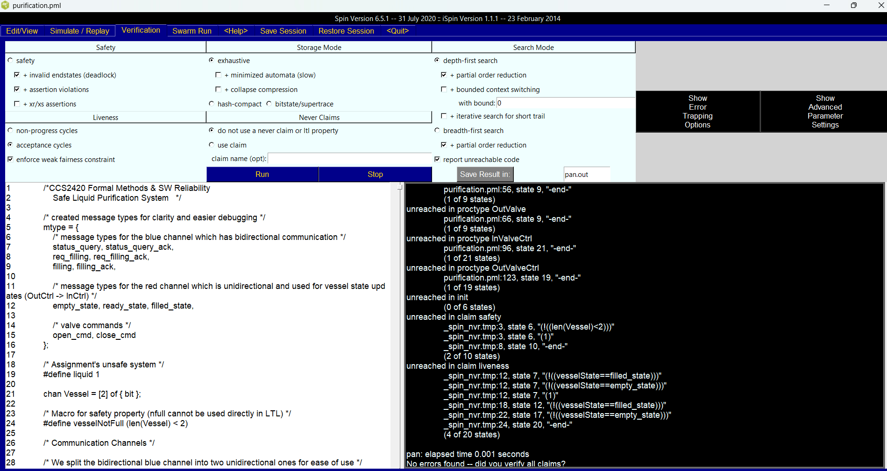
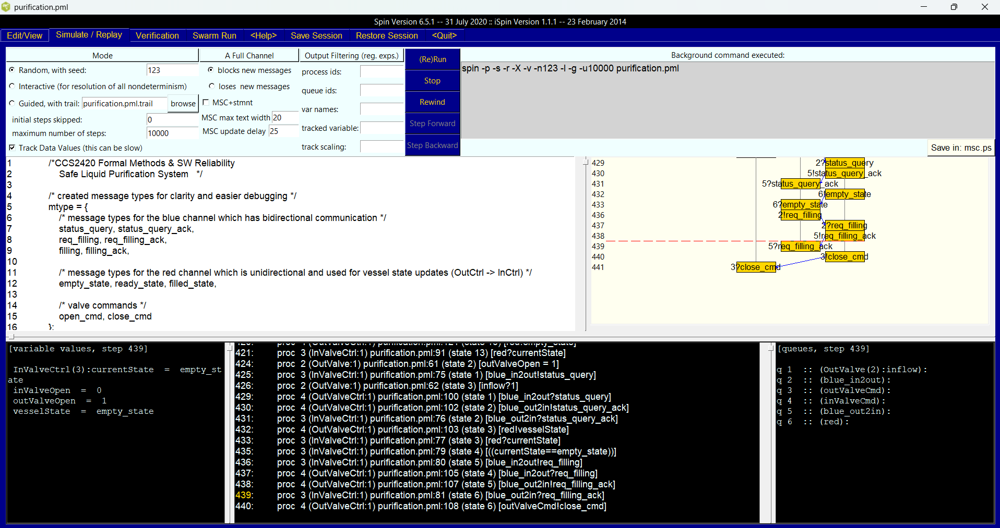

# Safe Liquid Purification System

A formally verified model of a simple computer-controlled liquid purification system using Promela and SPIN.

---

## Project Overview

This project implements a safe version of a liquid purification system where an inlet valve and outlet valve must coordinate to prevent vessel overflow. The original unsafe system allowed both valves to operate independently, creating potential for dangerous overflow conditions.

The safe implementation introduces controller processes that coordinate valve operations through a request-acknowledgment protocol, ensuring the vessel never becomes full while maintaining continuous operation.

**Key Properties Verified:**
- **Safety** - The vessel never overflows (always less than full capacity)
- **Liveness** - The system continuously cycles between empty and filled states

---

## System Architecture

The system consists of four concurrent processes:
- **InValve** - Physical inlet valve actuator
- **OutValve** - Physical outlet valve actuator
- **InValveCtrl** - Inlet valve controller (initiates filling cycles)
- **OutValveCtrl** - Outlet valve controller (manages vessel state)

Communication occurs through buffered channels:
- **Blue channel** - Bidirectional coordination between controllers
- **Red channel** - Vessel state updates from outlet to inlet controller
- **Command channels** - Valve open/close commands



---

## Tools Used

| Tool | Purpose |
|------|---------|
| **Promela** | Process Meta Language for modeling concurrent systems |
| **SPIN** | Model checker for formal verification of Promela models |
| **iSpin** | Graphical interface for SPIN with simulation and verification |

---

## Verification Results

### Safety Property

The safety property `[] (len(Vessel) < 2)` verifies that the vessel never reaches full capacity.

```
State-vector 72 byte, depth reached 398, errors: 0
      924 states, stored
     1571 states, matched
     2495 transitions (= stored+matched)
```



### Liveness Property

The liveness property `([] <> empty_state) && ([] <> filled_state)` confirms continuous operation.

```
Full statespace search for:
    acceptance cycles  + (fairness enabled)
    invalid end states +

errors: 0
```



### Simulation Trace

The simulation demonstrates the message exchange protocol between processes during a complete filling cycle.



---

## How to Run

### Prerequisites

- SPIN model checker (version 6.5.1 or later)
- iSpin GUI (optional, recommended for visualization)
- GCC compiler (for verifier compilation)

### Using iSpin (Recommended)

1. Open iSpin (ispin.tcl)
2. Load `purification.pml` via File > Open
3. To simulate:
   - Go to Simulate/Replay tab
   - Set simulation parameters
   - Click "Run"
4. To verify safety:
   - Go to Verification tab
   - Select "Safety" under properties
   - Click "Run"
5. To verify liveness:
   - Go to Verification tab
   - Check "Use Claim" and select "liveness"
   - Enable "Weak Fairness"
   - Click "Run"

### Using Command Line

**Simulation:**
```bash
spin -p -g -l purification.pml
```

**Safety Verification:**
```bash
spin -a purification.pml
gcc -DMEMLIM=1024 -O2 -DXUSAFE -DSAFETY -DNOCLAIM -o pan pan.c
./pan -m10000
```

**Liveness Verification:**
```bash
spin -a purification.pml
gcc -DMEMLIM=1024 -O2 -DXUSAFE -o pan pan.c
./pan -m10000 -a -f -N liveness
```

---

## File Structure

```
.
├── purification.pml      # Main Promela model
├── README.md             # This file
├── CCS2420_Report.docx   # Detailed project report
├── safety.txt            # Safety verification output
├── liveness.txt          # Liveness verification output
├── spin run.txt          # Simulation trace output
└── images/
    ├── system-diagram.png
    ├── safety-property-output.png
    ├── liveness-property-output.png
    └── simulation-output.png
```

---

## References

- Holzmann, G.J. "The SPIN Model Checker: Primer and Reference Manual"
- SPIN Documentation: http://spinroot.com/spin/whatispin.html
